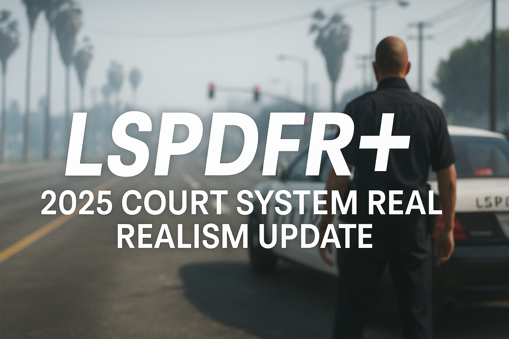

  

# LSPDFR+ 2025 - Court System Realism Update

**Author:** Sparky  
**Project:** LSPDFR+ Revival and Realism Expansion  
**Version:** 2025 Court System Update

# 🚓 LSPDFR+ 2025 - Court System Realism Update

A full revival and upgrade of Albo1125’s legendary LSPDFR+ plugin, rebuilt for 2025.  
Includes working Court Summons, realistic verdicts, jail sentences, and full support for both traffic stop and on-foot (Shift+Q) interactions.

---

## 🎯 Features

- ✅ **Court System Overhaul**
  - Dynamic Guilty / Not Guilty verdicts
  - Realistic fine calculation
  - Jail sentences for serious crimes (e.g., drug trafficking, DUI, murder)
  - Court menu (F9) with Pending & Published case tracking

- ✅ **Shift+Q Ticketing Menu Support**
  - Court Summons now fully supported on-foot
  - Ticket animations preserved
  - Delayed case creation after animation (1–7 min realism)
  - Full popup feedback & case tracking

- ✅ **Traffic Stop (E menu) Summons**
  - Still works with delayed case creation
  - Case moves to court after hearing time

- ✅ **Preserved Compatibility**
  - Fully compatible with Albo1125.Common
  - Does not break Arrest Manager, Traffic Policer, or other Albo-based mods

---

## 🧾 Requirements

- LSPDFR 0.4.9+
- RagePluginHook 1.119+
- [.NET Framework 4.7.2](https://dotnet.microsoft.com/en-us/download/dotnet-framework/thank-you/net472-web-installer)
- [Albo1125.Common 6.6.4.0 (Updated)](https://github.com/Sparky81x/Albo1125.Common-6.6.4.0)
- [RAGENativeUI](https://github.com/alexguirre/RAGENativeUI)

---

## 📦 Installation

1. Drop `LSPDFRPlus.dll` into:  
   `Plugins/LSPDFR/`

2. Ensure `Albo1125.Common.dll` is present (and updated)

3. Launch LSPDFR via RagePluginHook

---

## ⚖️ License

This project is licensed under the [GNU General Public License v3.0](LICENSE),  
in compliance with Albo1125's original LSPDFR+ source.

All source code changes have been made public as required.

---

## 💬 Support

Join the official support & update Discord:  
👉 [https://discord.gg/3E5JyujUXw](https://discord.gg/3E5JyujUXw)
