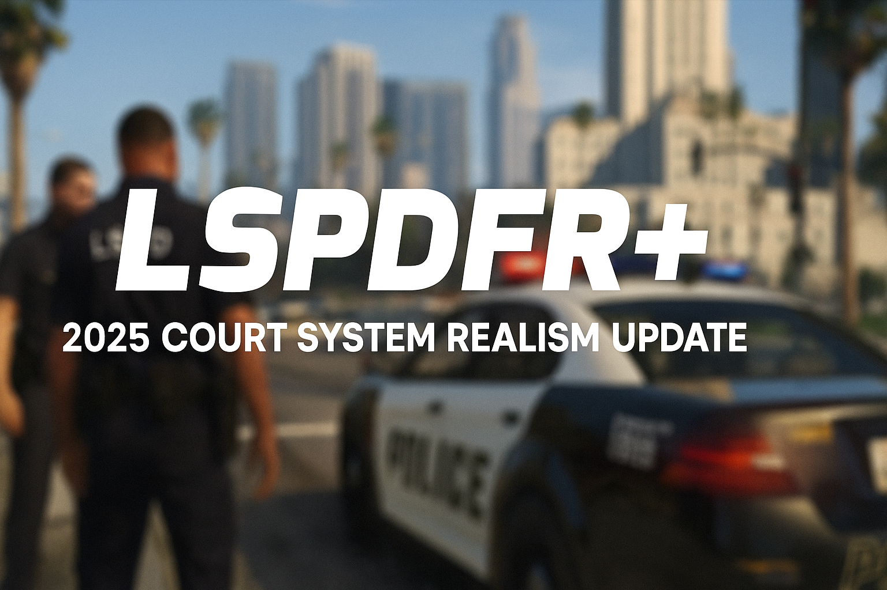

  

# LSPDFR+ 2025 - Court System Realism Update

**Author:** Sparky  
**Project:** LSPDFR+ Revival and Realism Expansion  
**Version:** 2025 Court System Update

---

## 📦 About This Project

This project overhauls the Court System inside LSPDFR+,  
bringing dynamic verdict generation, realistic fine calculations, randomized jail sentences, and expanded serious crime handling.

Built on the foundations laid by Albo1125,  
this update fully modernizes the LSPDFR+ Court System for 2025 and beyond.

---

## 🛡️ Key Features

- Dynamic court verdict generation after hearing times pass.
- Minor offences generate dynamically calculated fines.
- Major felony offences trigger randomized jail sentences (2–10 years).
- Expanded American Offences list with serious crimes like Drug Trafficking and Assault.
- Full API compatibility with legacy plugins.
- Smooth player experience with background court processing.

---

## 📂 Installation Instructions

- Place the compiled `LSPDFR+.dll` into your `plugins/LSPDFR/` folder.
- Update `plugins/LSPDFR/LSPDFR+/Offences/American.xml` if you want the expanded serious offences (optional but recommended).
- Launch RagePluginHook.
- No need to reset saves — fully backward compatible with your CourtCases.xml.

---

## 📜 Downloads

- **LSPDFR+ 2025 Court System Update:**  
🔗 [Download LSPDFR+ 2025 Release](https://github.com/Sparky81x/LSPDFR-Plus-2025Update/releases)

- **Required Dependency - Albo1125.Common v6.6.4.0:**  
🔗 [Download Albo1125.Common v6.6.4.0 Release](https://github.com/Sparky81x/Albo1125.Common-6.6.4.0/releases)

---

## 📜 Credits

- Original Development: **Albo1125**
- 2025 Realism Overhaul: **Sparky**

---

# 📣 Protect and Serve — now with real consequences. 🚓
